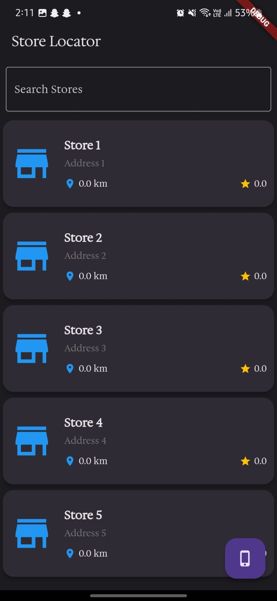
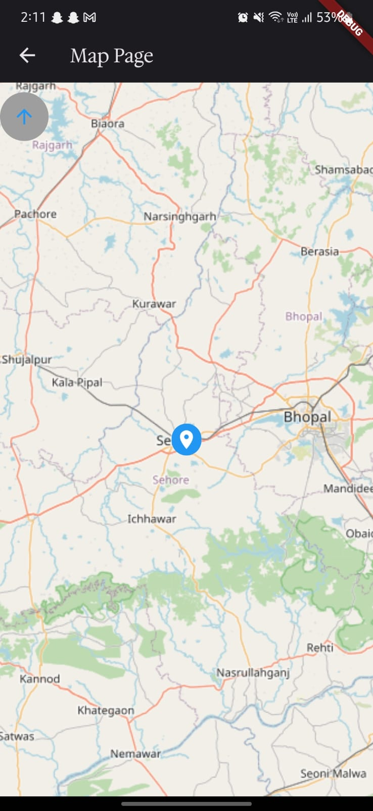

# Localies App

Localies App is a Flutter-based mobile application designed to help users locate stores and view their details, including products and ratings. The app features a map view with dynamic rotation and a list view with pagination.

## Features

- **Store Locator**: Find stores based on your location.
- **Store Details**: View detailed information about each store, including products and ratings.
- **Map View**: Interactive map with dynamic rotation and compass.
- **List View**: Paginated list of stores with search functionality.
- **Custom Fonts**: Beautiful custom fonts for enhanced UI.


## APK link here
[Install Apk here](apk/app-release.apk)
## Screenshots

  

## Installation

1. **Clone the repository**:
   ```sh
   git clone https://github.com/yourusername/localies_app.git
   cd localies_app
   ```

2. **Install dependencies**:
   ```sh
    flutter pub get
   ```

3. **Run the app**:
   ```sh
   flutter run
   ```

## Dependencies
- Flutter
- cupertino_icons
- geolocator
- provider
- flutter_map
- latlong2
- flutter_map_compass


## Project Structure
```sh
localies_app/
├── android/
├── assets/
│   ├── fonts/
│   └── images/
├── ios/
├── lib/
│   ├── models/
│   ├── providers/
│   ├── screens/
│   ├── services/
│   ├── widgets/
│   └── main.dart
├── macos/
├── test/
├── web/
├── pubspec.yaml
└── README.md
```

## Usage

### Store List View
 - The store list view displays a paginated list of stores. Users can search for stores using the search bar at the top.

### Map View
 - The map view displays stores on an interactive map. Users can rotate the map, and the rotation degree is displayed dynamically.

## Customization

To add new stores, update the db_service.dart file in the services directory:

```sh
Store(
  name: 'New Store',
  address: 'New Address',
  contactNumber: '1234567890',
  description: 'New Store Description',
  openingHours: '9:00 AM - 6:00 PM',
  latitude: 28.646223,
  longitude: 77.205004,
  products: [
    Product(name: "New Product", price: 1000.0, availability: true),
  ],
),

```


## Custom Fonts

```sh
fonts:
  - family: CustomFont
    fonts:
      - asset: assets/fonts/CustomFont-Regular.ttf
```


## Acknowledgements
 - Flutter
 - OpenStreetMap
 - Pub.dev